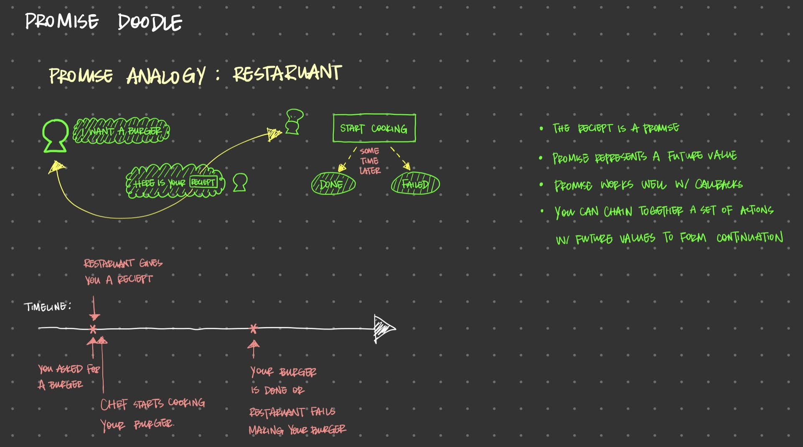
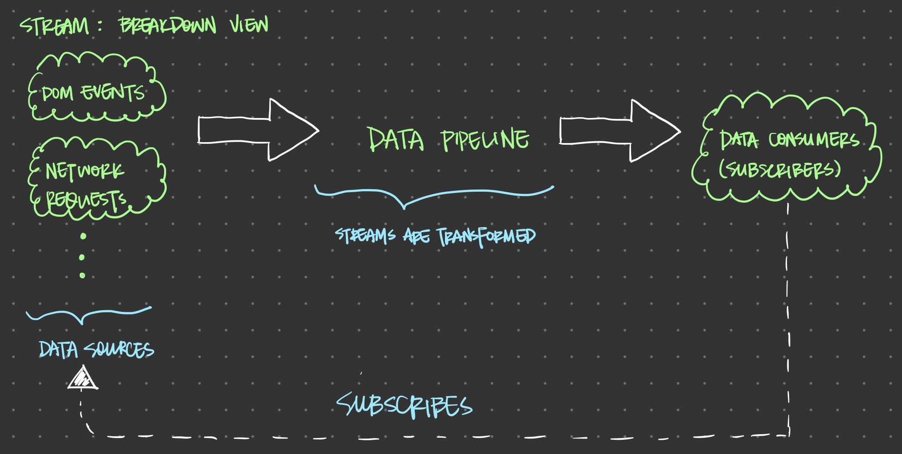

### Synchronous vs. Asynchronous computing
The main difference between synchronous and asynchronous computing/code is **latency/waitime**.

#### Blocking code
Synchronous execution occurs when each block of code must wait for the previous block to complete before running.
- Easy to implement
- Easy to understand
- Easy to debug

JavaScript is a single-threaded language. Writing blocking code creates awful user experience.
- waiting for AJAX call to return
- waiting for database operations to complete
The entire application would pause/sit idle waiting for the data to be loaded and wasting precious computing cycles that could be executing other code.

Other than horrible user experience, browsers may deem your scripts unresponsive after a certain period of inactivity and terminate them.

#### Non-blocking code with callback functions


As a single-threaded language, JavaScript provides callback functions to tackle the problem of blocking for long-running operations to complete by allowing you to provide a handler function that the JavaScript runtime will invoke once the data is ready to use.
- JavaScript callback functions create **inversion of control** where functions call the application back insetad of the other way around.
- Inversion of control refers to the way in which certain parts of your code receive the flow of control back from teh runtime system.

Callback functions allow you to invoke code asynchronously, so that the application can return control to you later. This allows the program to continue with any other task in the meantime.

#### Time and space
- Synchronous functions allows us to reason directly about the state of the application
- Asynchronous code forces us to reason about its **future** state

For example, if you have three functions performing three independent tasks, then executing them in any order wouldn't matter. However, if they are sharing some global state, their behavior would be determined by the order in which they were called -> ***Side Effect***

#### Callback or RxJS?
- If your script issues a single remote HTTP request, RxJS is an overkill, callbacks remain the perfert solution.
- RxJS begins to shine when implementing state machines of advanced complexity such as:
  - dynamic UIs: rich UI made up of several widgets on the page that interact with each other
  - service orchestration: orchestrate the execution of several business process that consumes several microservice, data mashups

<pre>
// Example: callback hell
ajax(
    '<host1>/items',
    items => {
        items.forEach(item => {
            ajax(`<host2>/items/${items.getId()}/info`, dataInfo => {
                ajax(`<host3>/files/${dataInfo.files}`, processFiles)
            });
        });
    },
);
</pre>

#### Event Emitters
Event emitter is a popular mechanism for asynchronous event-based architecture.
- __DOM__ is an event emitter.
- `EventEmitter` class in NodeJs is used to implement APIs:
  - WebSocket I/O
  - File reading & writing

Subscribing to an event emitter is done through the `addListener()` method, which allows you to provide the callback that will be called when an event of interest is fired.

Unfortunately as you can tell, event emitters have all the same problems associated with using callbacks to handle emitted data coming from multiple composed resources.

#### Promises
`Promises` represent any asynchronous computatation that is expected to complete in the **future**. You can chain together actions with future values to form a **continuation** (i.e., callbacks).

A `Promise` is a data type that wraps an asynchronous or long-running operation, **a future value**, with the the ability for you to subscribe to its result or its error.
* One cannot alter the vlaue of a `Promise` once it has been executed, the value is **immutable**.



#### What problems are RxJS solving?
RxJs is combining both functional and reactive programming paradigms:
* `for` and `while` loops are not async aware, meaning they do not have knowledge of wait time or latency between iterations.
* Nested callbacks (callback hell) are hard to reason about.
* Error handling become convoluted when you begin to nesting try/catch blocks within each callback.
* Excessive use of closure -> side effects -> bad.
* It is hard to determine when to cancel a long-running operation.
* It is hard to deal with throttle and debounce in the traditional way.
* As the UI becomes larger and richer, memory management becomes harder (memory leaks and growth of browser process become noticable).

The goal is to abstract the notion of time/latency away from our code and model our async code using a linear sequence of steps **through which data can flow over time**.
* Works with both synchronous and asynchronous code
* Handles errors
* Discourage side effects
* Scales out from one to a stream of events

### Thinking in streams
Definition of a **stream** traditionally is an abstract object related to I/O operations such as reading a file, reading a socket or requesting data from an HTTP server.
* Node has readable, writable and duplex streams.

Defintion of a **stream** in the Reactive Programming world is expanded to *any data source that can be consumed*.

#### Propogation of Change
<pre>
let a = 20;
let b = 22;
let c = a + b; // c = 42
a = 100;
// c is still 42
</pre>
The code above has no **propogation of change**.

<pre>
// Create A$ and B$, two data streams.
const A$ = [20];
const B$ = [22];
const C$ = A$.concat(B$).reduce(add);
// C$ is a stream with values: [42]
A$.push(100);
// Now what values does C$ have?
</pre>
If A$ receives a new value, this state is pushed through any streams that it's a part of.

**Reactive programming is oriented around data flows and propogation.**

In the example above, C$ is an always-on varaible that *reacts* to any change and causes actions to ripple through it when any constituent part changes.
_______________________________________________________________________________
### Stream breakdown view



* Data source = producer
  * DOM events: mouse clicks, key presses, etc.
  * Network requests
* Consumer = subscribers of the data source

**A stream is nothing more than a sequence of events over time.**
* A stream can be applied to ANY data point that holds value, from a single integer to bytes of data received from a remote HTTP call.
* A stream stays idel/does nothing until there is a subscriber (or observer) that listens for it.
  * streams are **lazy** data types.
  * different from `Promise` since it executes its operations as soon as they are created.
* The data pipeline shown above consists of a list of RxJS operators to transfor the values from the data sources into the desired form and pass to the observers.

### Static data sources
Static data sources include: numbers, strings, sequences and arrays.
```javascript
Stream([1, 2, 3, 4, 5])
  .filter(num => (num % 2) === 0)
  .map(num => num * num)
  .subscribe(val => {
    console.log(val);
  });
// Outputs: 4, 16
```
* `Stream([1, 2, 3, 4, 5])` is the data source.
* `filter` and `map` are the data operators in the data pipeline.

### Components of an Rx stream
* Producer
* Consumer
* Data pipeline
* Time

#### Producers
Producers are the source of your data. A producer is the starting point for any logic that you will perform in RxJS.
* A producer is created from something that generates events independently, anything from a signle value, an array, mouse clicks, to a stream of bytes read from a file.
* A producer is the *subject* in Observer design pattern.
* A producer is referred to as `Observable` in RxJS, something that can be observed.
* An observable is in charge of pushing notifications, *fire-and-forget*.

#### Consumers
A consumer accepts events from the producer and prcess them. When a consumer begins listening to the producer for events to consume, the stream is activiated, meaning the stream (the producer) starts pushing events.