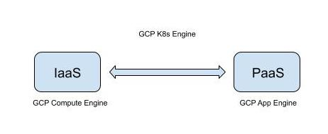
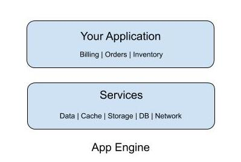
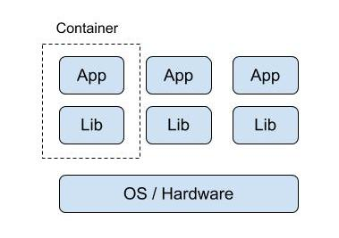
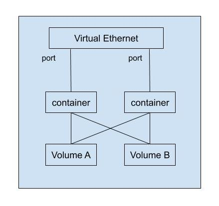

## Containers, K8s, and K8s Engine


- GCP Compute Engine is an IaaS offering, which allows users to run VMs on the cloud and give you persistent storage and networking for the VM instances.
- GCP App Engine is a PaaS offering.

### IaaS vs PaaS vs K8s Engine

IaaS offering allows you to share compute resources with others by virtualizing the hardware:

- Each VM has its own instance of an OS
- You can build and run applications on the VM with access of memory, file system, networking interfaces and other attributes that physical computer also has.
- The smallest unit of compute in this environment is a VM together with its applications like OS (which can be large and can take a long time to boot up)
    - Often it is worth it, VMs are high configurable and you can install and run your tools of choice
        - you can configure the underline system of resources (e.g., disks and networking)
        - you can install your web server, database middlewares
    - As demand increases, you need to **scale out in units of entire VM with an OS for each → resource consumption might grow faster than you would like**

PaaS offering instead of getting a blank VM, you get access to a family of services that applications need. All you do is to write your code in self-contained workloads that use these services and include any dependent libraries.
- As demand for your application increases, the platform scales your application seamlessly and independently from workload infrastructure.
- **You give up the control over the underline server architecture**


The idea of a container is to give you:
- the independent scalability of workloads (like you get in a PaaS environment)
- an abstraction layer of the OS and hardware (like you get in a IaaS environment)


What you get from containers is an invisible box to run your code and its dependencies with limited access to its own partition of the file system and hardware.
- A container can start as quickly as a new process (comparing this with the time it takes to boot up the entire new instance of an OS)
- All you need on each host is an OS that supports containers and a container runtime
    - In essence, you are virtualizing the OS rather than the hardware
    - The environment scales like PaaS but gives you nearly the same flexibility as IaaS
- **The container abstraction makes your code very portable**
    - You can treat the OS and hardware as a blackbox
    - You can move your code from development to staging to production, or from your laptop to the cloud without changing or rebuilding anything

If you want to use a lot of containers to build your application, each container performs its own function (micro-service pattern), the units of code running in these containers can communicate with each other over a network fabric.
- You can make your application modular → deploy easily and scale independently across a group of hosts
    - the hosts can scale up and down
    - the hosts can start/stop containers as demand for your application changes
    - the hosts can fail, they can be replaced

A tool that helps you do all the above well is Kubernetes (K8s)
- Orchestrate many containers on many hosts
    - Scale them
    - Roll out new versions of them
    - Roll back an old version if things go wrong

### How to Build and Run Containers
The most common format for container images is the one defined by **Docker**

Example: a Python application
```
from flask import Flask
app = Flask(__name__)
@app.route("/")
def hello():
    return "Hello World!\n"
@app.route("/version")
def version():
    return "Helloworld 1.0\n"
if __name__ == "__main__":
    app.run(host="0.0.0.0")
```
This application requires Python, Flask and some other dependencies.
- Use Dockerfile to specify how your code gets packaged into a container
```
FROM ubuntu:18.10
RUN apt-get update -y && \
    apt-get install -y python3-pip python3-dev
COPY dependencies.txt /app/dependencies.txt
WORKDIR /app
RUN pip3 install -r dependencies.txt
COPY . /app
ENTRYPOINT ["python3", "app.py"]
```
Build and run
```
# Build the container and store it on the local system as a runnable image
> docker build -t py-server .
# Run the container image
> docker run -d py-server
```
In the real world situation, you might want to upload your container image to a container registry service (Google Container Registry) and share and download it from there.

### Kubernetes

Kubernetes is a container orchestrator to better manage and scale your applications:

- K8s allows you deploy containers on a set of nodes called **cluster**
    - Cluster is a set of master components that control the system as a whole and a set of nodes that run containers
    
    - In K8s, a node represents a compute instance
    - In Google Cloud, nodes are VMs running on Compute Engine
    - To use K8s, you can define a set of applications and how they should interact with one another, and K8s figures out how to make it happen.
        - K8s makes it easy to run containerized applications
    - How to build a K8s cluster? → **Google Cloud K8s Engine: K8s as a managed service in the cloud**
        - You can build it on your own hardware or any environment that provides VM, however if you build it yourself, you have to maintain it.
        - You can create K8s cluster using GCP console or GCP CLI
            - GKE can be customized and supports different machine types, number of nodes and network settings
    ```
    # Create a K8s cluster with K8s Engine
    > gcloud container clusters create k1
    ```

    When K8s deploys a container or a set of related containers:
    - It does so inside an abstraction: **Pod, a smallest deployable unit in K8s**
        - Think of Pod as a running process on your cluster: it can be one component of your application or the entire application.
        - It is common to have one container per pod, but if you have multiple containers with hard dependencies, you can package them into a single pod.
        - The containers in the same pod automatically share networking and they can have disk storage volumn in common.
        - Each pod in K8s gets a unique IP address and a set of ports for your containers.
        - The containers in the same pod can use localhost network interface to communicate with one another, they don’t know or care which node they are deployed on.
        

How to run a container in a pod in K8s
```
# Run a container with Nginx web server image pulled from a container registry
> kubectl run nginx --image=nginx:1.15.7
```
- A deployment in K8s presents a group of replicas of the same pod, K8s keeps your pods running, even when a node on your pods fails.
- You can use a deployment to contain a component of your application or the entire application (e.g., Nginx web server)
    - To see the running Nginx pod: `kubectl get pods`
    - By default pods in a deployment only accessible inside the cluster, if you want to expose the content in the Nginx web server to the internet and make your pods in the deployment publicly available, you can connect a load balancer to it:
        - K8s creates a  with a fixed IP address for your pods
        **service**
        - A service is a fundamental way K8s represents load balancing
            - A service groups a set of pods together and provides a stable endpoint for them
        - in GKE, this kind of load balancers created as a network load balancer, is one of the managed load balancing services that Compute Engine makes available to VMs, **GKE makes it easy to use it with containers**
```
# Request k8s to attach an external load balancer
# with a public IP address to your service so that
# others outside the cluster can access it
> kubectl expose deployments nginx --port=80 --type=LoadBalancer
```

e.g., Any client that hits the public IP address will be routed into a pod (Ngnix web server pod) behind the service (a public IP address managed by a network load balancer)

- **Why do you need a service?** Consider your application contains a frontend and a backend, the frontend could access the backend using the internal IP addresses of the pods without a need for a service → management problem:
    - **As deployment creates and destroy pods, pods get their own IP addresses but these IP addresses won’t remain stable overtime. → Service provides the stable endpoint you need.**

```
> kubectl get services
# NAME    TYPE           CLUSTER-IP    EXTERNAL-IP       PORT(S)   AGE
# nginx   LoadBalancer   10.0.65.118   XXX.XXX.XXX.XXX   80/TCP    5m
```

Clients can use the external IP address to hit the ngnix container remotely.

**What if you need more power, to scale a deployment?**

```
# Scale from 1 to 3 Nginx web servers
> kubectl scale nginx --replicas=3
```

These 3 Nginx web servers are all behind the service, they are all available with one fixed IP address.

```
# Set autoscale based on CPU usage with min and max nubmers of pods
> kubectl autoscale nginx --min=10 --max-15 --cpu=80
```

The real strength of K8s comes when you work in a declarative way: provide a K8s configuration file that K8s understands what you want, what your goal state looks like, and K8s figures out how to achieve the goal state.

```
> kubectl get pods -l "app=nginx" -o yaml
```

Example: nginx-deployment.yaml

```
apiVersion: v1
kind: Deployment
metadata:
    name: nginx
    labels:
        app: nginx
spec:
    replicas: 3
    # Deployment use this selector to group specific pods
    # as replicas
    selector:
        matchLabels:
            app: nginx
    template:
        metadata:
            labels:
                app: nginx
        spec:
            containers:
            - name: nginx
              image: nginx:1.15.7
              ports:
              - containerPort: 80
```

To update and apply changes to the configuration

```
> kubectl apply -f nginx-deployment.yaml
```

To view the states of the replicas

```
> kubectl get replicasets
# NAME             DESIRED        CURRENT     READY        AGE
nginx-xxxxxxx      3              3           3            18s
```