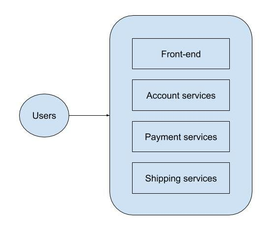
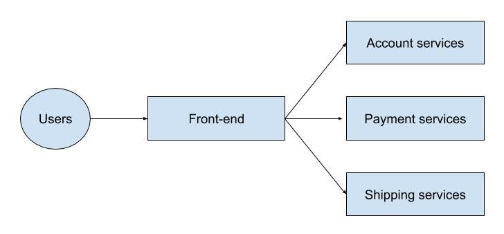
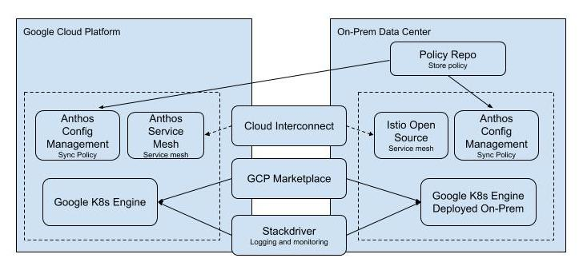

## Monolithic Application


## Monolithic Application

- Move only some of your compute workloads to the Cloud
- Move at your own pace
- Take advantage of Cloud’s scalability and lower costs
- Add specialized services to your compute resources stack

**Antho** is Google’s modern solution for hybrid and multi-cloud systems and services management
- K8s and GKE On-Prem create the foundation
- On-premises and Cloud environments stay in sync
- A rich set of tools is provided for
    - Managing services on-premises and in the Cloud
    - Monitoring systems and services
    - Migrating applications from VMs into your clusters
    - Maintaining consistent policies across all clusters, whether on-premises or in the Cloud

### Building a modern hybrid infrastructure with Anthos


- GKE is a managed production-ready environment for deploying containerized applications
    - Auto node repair
    - Auto upgrade
    - Autoscaling
- Uses regional clusters for high availability with multiple masters
- Node storage replication across multiple zones
- GKE deployed on-prem is a turn-key production-grade conformed version of K8s with the best practice configuration already pre-loaded
    - provides access to container services on GCP
        - Cloud build
        - Container registry
        - audit logging
    - integrates with Istio, Knative and Marketplace solutions
- GKE and GKE deployed on-prem both integrate with GCP Marketplace, so all of the clusters in your network, whether on-premises or in the Cloud, have access to the same repository of containerized applications.
    - allows you to use the same configurations on both sides of the network
    - reduces the time spent developing applications
- Anthos and Istio Open Source service mesh communicate across hybrid network using Cloud Interconnect to sync and pass microservices data
- Anthos Config Management provides single source of truth for your cluster configuration
    - Policies are stored in a Git Repo
    - Can be hosted on-premises or Cloud

### Getting Started with GEK
```
# Create a cluster named "webfrontend" with 2 nodes located
# in zone "us-central1-a" (view the VM instances in Compute
# Engine)
# `gcloud container clusters create` command automatically
# authenticated kubectl for you
> gcloud container clusters webfrontend --zone us-central1-a --num-nodes 2
# K8s commands
# 1. Launch a signle instance of nginx container
#    Note: in K8s, all containers run in pods, this command
#          is to create a deployment consisting of a single
#          pod containing the nginx container. A K8s deployment
#          keeps a given number of pods up and running even in
#          the event of failures among the nodes on which they
#          run. By default, the number of pods is 1
> kubectl create deploy nginx --image=nginx:1.17.0
# 2. Expose the nginx container to the Internet
#    Note: K8s created a service and an external load balancer
#          with a public IP address attached to it. The IP address
#          remains the same for the life of the service. Any
#          network traffic to that public IP address is routed to
#          pods behind the service, in this case, a nginx pod
> kubectl expose deployment nginx --port 80 --type LoadBalancer
# 3. Scale up the number of pods running on your service
> kubectl scale deployment nginx --replicas 3
```
