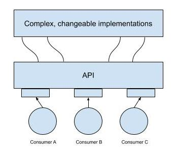

## Google Cloud Endpoints and Apigee Edge

### What is an API

Application Programming Interfaces hide details, enforce contracts



- Application developers structure the software they write so that it presents a clean, well-defined interface that abstracts away the needless details and then they document that interface.
- If you have to change the API (add or deprecate a feature), you version the API
    - Programs that consume the API can specify the API version that they want to use in their calls

GCP provides two API management tools: Google Cloud Endpoints & Apigee Edge

### Google Cloud Endpoints

When developing a software service and one of GCP’s backends, you’d like to

- make it easy to expose this API
- make sure it’s only consumed by other develops whom you trust
- have an easy way to monitor and log its use
- have a single coherent way for the API to know which end user is making the call

Cloud Endpoints helps you create and maintain APIs, it implements the above capabilities using an easy-to-deploy proxy in front of your software service

- Distributed API management through an API console
- Expose your API using a RESTful interface
- Control access and validate calls with JSON Web Tokens and Google API keys
    - Identify web, mobile users with Auth0 and Firebase Authentication
- Generate client libraries

Cloud Endpoints supports applications running in

- GCP App Engine Flexible Environment
- K8s Engine
- Compute Engine

Cloud Endpoints supports applications running in the languages and client technologies of your choice

- Android
- iOS
- JavaScript

### Apigee Edge

Apige Edge is a platform for developing and managing API proxies (making APIs available to your customers and partners).

- It has a focus on business problems, e.g., rate limiting, quotas, analytics
    - Many users of Apigee Edge are providing a software service to other companies and these features come in handy.
- It contains analytics, monetization, and a developer portal
- Backend services for Apigee Edge **need not be in GCP**
    - Engineers can use Apigee Edge to take apart a legacy application. Instead of replacing a monolithic application in one risky move, they can instead use Apigee Edge to peel off its services one by one, standing up microservices to implement each in turn, until the legacy application can be finally retired.

### Get Started with App Engine
In an example application repository, `app.yaml` is the application configuration file that specifies
- runtime of the application, e.g., `python27`
- handlers (URLs on which the application responds) and required libraries

```
> cd application_root_dir
# Deploy the application to the App Engine service
# Note: App Engine files are stored in Google Cloud Storage
> gcloud app deploy ./index.yaml ./app.yaml
```

After the deployment, you can go to GCP console → App Engine → Dashboard and view your application status, link to your application.