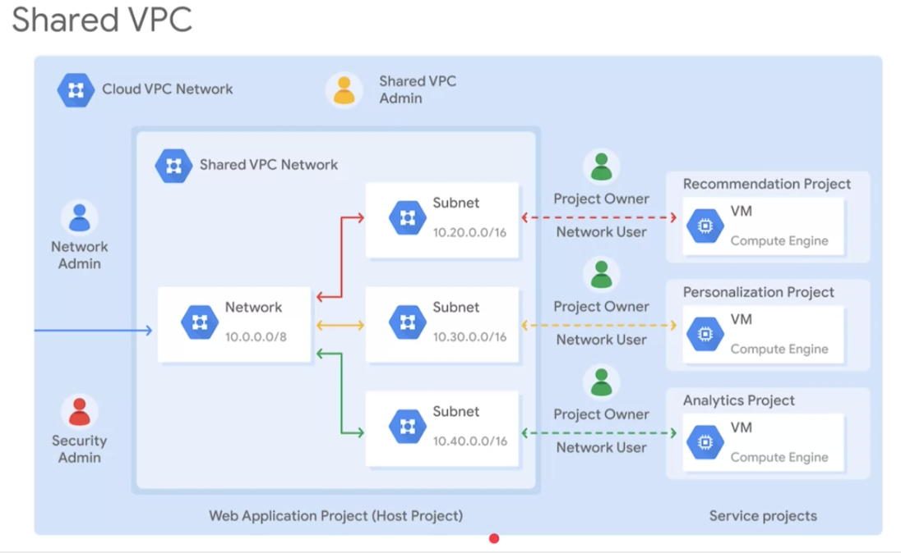

_______________________________________________________________________________
## Shared VPC
Shared VPC allows an organization to connect resources from multiple projects to a common VPC network.
* This allows your resources to communicate with each other securely and efficiently using **internal IPs** from the network.

<pre>
x   -------------         -------------------------------------------------
x  | On-Premises | ---   | Shared VPC Network           -----------------  |
x   -------------     |  |                          ---|  Recommendation | |
x                     |  |                         |   |     Service     | |
x                     |  |                         |    -----------------  |
x                     |  |    -----------------    |    -----------------  |
x                     |--|---|  Web App Server |---|---| Personalization | |
x                     |  |    -----------------    |   |     Service     | |
x                     |  |                         |    -----------------  |
x                     |  |                         |    -----------------  |
x                     |  |                          ---|    Analytics    | |
x   -------------     |  |                             |     Service     | |
x  |   Clients   | ---   |                              -----------------  |
x   -------------         -------------------------------------------------
</pre>

For example, there is one network that belongs to the web app server project. This network is shared with three other projects: recommentation service, personalization service and analytics service. Each of these service project has instances that are in the same network as the web app server, allowing private communication to that web app server using internal IP addresses. The web app server communicates with Clients and on-premises using these services external IP addresses. The backend services cannot be reached externally, because they only communicate using the internal IP addresses.

When you use shared VPC, you designate a project as the HOST project, and attach one or more service projects to it. In the example above, the web app server project is the host project, the overall network is called the shared VPC network.

### Provisioning shared VPC
Shared VPC makes use of Cloud IAM roles for delegated administration.

How to provision a shared VPC network?

Required administrative roles:
* Organization admin
  * Organization is the root node in the resource hierarchy of GCP.
  * Workplace or Cloud Identity super administrators assign organization admins.
  * Organization admin role in provisiioning shared VPC is to nominate Shared VPC admin by granting them appropriate project creation and deletion roles, and `compute.xpnAdmin` role for the organization.
* Shared VPC admin
  * enables sahred VPC for host project
  * attaches service projects
  * delegates access to some or all subnets in shared VPC network `compute.networkUser`.
  * typically a shared VPC admin is also the project owner for a given host project.
* Service project admin
  * Network user
  * Control over service project resources: compute instance admin, project owner
  * Create resources in shared VPC: VM instances, instance templates and groups, static internal IP, load balancers

* The shared VPC admin which was nominated by organization admin, configures the Web App Server Project as the host project with subnet level permissions.
  * Doing so allows the shared VPC admin to selectively share subnets from the VPC network.
* The shared VPC admin attaches the 3 service projects to the host project and gives each project owner the `networkUser` role for the corresponding subnets.
* Each service project owner then creates VM instances from the service project in the shared subnets.
  * Billing for these VM instances is tributed to the projects from where the resources are created, in this case, it is the service projects.
* The shared VPC adim has full control over the resources in the host project, including adminitration of shared VPC network.
  * The shared VPC admin can delegate the network admin and security admin roles for the host project.

Overall shared VPC is a centralized approach to multi-project networking because security and network policy are crecinates a single VPC network.
