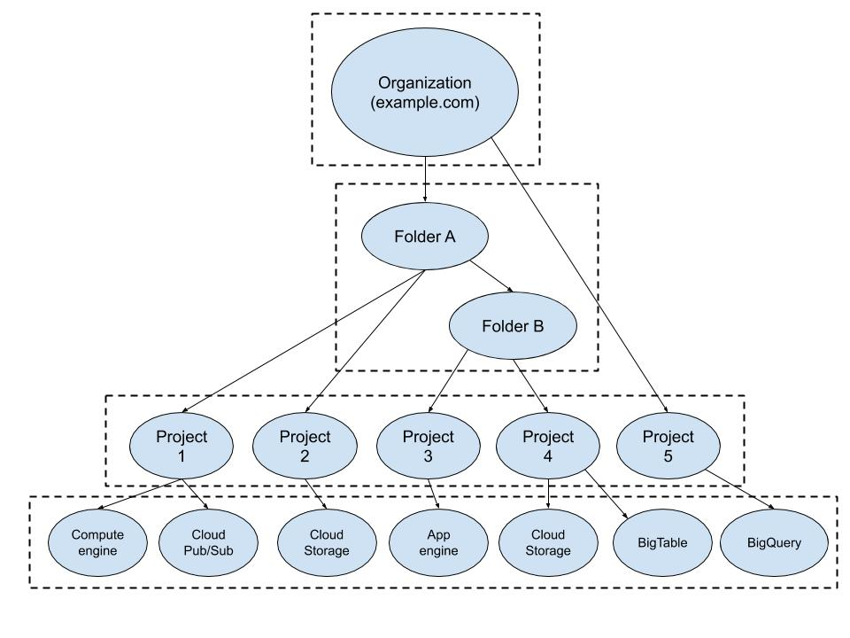

_______________________________________________________________________________
## IAM Overview
IAM (Identity and Access Management) allows administrators *authorize* who can take action on specific resources.
* giving the administrator fully control and visibility to manage their cloud resources centrally
* centrally manage your projects, folders and organizations
* centrally manage IAM roles and policies (including custom roles and IAM labels)

## GCP Resource Manager
### GCP Resource Manager overview
IAM administrates and authorizes who can do what on which resources in GCP.
* GCP provides resource containers: organization, folder, project, which allow you to group and hierarchically organize Cloud resources.
* Resource manager enables you programmatically manage these resource containers.

### GCP Resource Manager Objects
* GCP resource manager objects are the various resources members can access and use on GCP.
* GCP resource manager objects hold data and applications and also help to organize it and secure it.

Resource manager objects include:
* organization
* folder
* project
* resource
* member
* role

The GCP resource hierarchy allows you to map your organization onto your approporiate GCP objects and presents logical attach points for access management policies.
* the organization node is the root node for Google Cloud resource hierarchy.
  * it is a super node for all of your projects and resources
  * it represents your organization
* the folders can be used to implement organization structure and group projects by department, team, application, or environment.
  * a folder can contain projects, other folders, or a combination of both.
  * organization can use folders to group proejcts under the organization node in a hierarchy.
  * for example, your organization contains multiple departments, each with its own set of GCP resources. Folders allow you to group these resources.
  * each folder or resource can only have exactly **ONE** parent.
  * folders are used to group resources that share common IAM policies.
  * the use of folders to organize resources is optional
* the projects are **required** in GCP.
  * any resource deployed must be associated with a project.
  * projects provide many management related features:
    * the ability to track resources
    * quota usage
    * assign projects to different billing accounts
    * assign manager permissions and credentials
    * selectively enable specific services and APIs at the project level

### Resource Manager Accounts
#### Member roles
A role is a collection of permissions.
* You cannot assign a permission to a user directly.
* You grant the users a **role**.
* Members can be expressed as individual users, groups, domains or even the public as a whole.
* You can assign Cloud IAM roles to a new member using Cloud IAM policies.

#### Service Accounts
You can also grant roles to service accounts:
* Service accounts control server-to-server interactions and are used to authenticate from one service to another.
* The roles granted to the service accounts control what actions application running under a service account can perform.

For example, if an application running on a GCE instance needs to read a file from Cloud Storage, a service account with Cloud Storage object fro your role can be assigned to the GCE instance. An application running on that instance would then be permitted to read a file from Cloud Storage.

Serivce accounts are identified with a Google-managed email address in the `gserviceaccount.com` domain.

By default, when using service accounts within GCP (e.g., from GCE or GAE), Google automatically manages the keys for the service accounts. The GCP managed keys are rotated approximately once a week. <- Google-managed keys

It is also possible to use service accounts outside of GCP by manually creating and managing service account keys by yourself. <- customer-managed keys

## IAM Labels
IAM Labels are created in the form of a *key-value* pair, used to help you organize and manage your cloud resources.
* used to distinguish between resources owned by different teams for budgeting or billing purposes
* used to label and categorize different components of a large distributed application
  * front-end component
  * dashboard component
* used to show which systems in your network are for production use and which are for testing environment
* used to indicate the state of an instance of a resource (e.g., if the instance is in the active or archived state)
* used to distinguish between VMs

### Label requirements
Requirements for label names and values:
* No more than 64 labels per resource
* Must be in the form of a key-value pair
* Keys cannot be empty and must be between 1-63 characters
* Values may be empty but cannot exceed 63 characters
* Keys and values can contain only lowercase letters, numeric characters, underscores and dashes
* The key portion of a label must be unique. However you can use the same key with multiple resources.
* Keys must start with a lowercase letter or international character

Make sure you do not include sensitive data in your label names or values.

## IAM Roles
In GCP, you can grant permissions by granting roles.

### Types of IAM roles
* Primitive roles
  * Primitive roles exist prior the introduction of IAM.
  * Primitive roles are applied at the project or service resource levels and control access to all resource in that project or resource.
  * Primitive roles control what can be done on ALL resources in a project.
  * Three primitive roles: *Owner*, *Editor* and *Viewer*.
* Predefined roles/Curated roles
  * Predefined roles are the IAM roles that give finer grained access control than the primitive roles.
  * Each GCP service offers a set of predefined roles.
  * Predefined roles are designed to map to job functions, for example, Compute Network Admin, Security Reviewer, Storage Admin, etc.
  * Predefined roles are managed by GCP.
* Custom roles
  * You can define roles consisting of permissions and resources of your choice.

## IAM Policies
A Cloud IAM policy is used to specify access control policies for your cloud resources.

### Definitions
A policy is a collection of access statements attached to your resource.
* A policy consists of a list of bindings.
* A binding binds a list of members to a role where the members can be:
  * user accounts
  * Google group
  * Google domain
  * service accounts
* A role is a named list of permissions defined by Cloud IAM.

Each policy contains a set of roles and role members with resources inheriting policies from their parent.
* resource policy is a union of parent and resources where a less restrictive parent policy will always override a more restrictive resource policy.

### Orgnization policies
An organization policy is a configuration of restrictions, defined by configuring a constraint with desired restrictions. It is applied to the organization node and all of its folders and projects.
* A constraint is a type of restriction against the GCP service or list of GCP services.
* A constraint can be thought of as a blueprint that defines which behaviors are controlled.
  * disable VM serial port access
  * disable service account creation
  * disable VM nested virtualization
  * define trusted image projects

## IAM recommender
IAM recommender helps you enforce the principle of least privilege by ensuring that members have only the permissions that they actually need.
* IAM recommender evaluates only role grants that were made at the **project** level and existed for at least 90 days.
* IAM recommender does NOT evaluate:
  * conditional role grants
  * role grants for Google managed service accounts
  * access controls that are separate from Cloud IAM

### Recommendations
* IAM recommender will suggest you to revoke a role/permission not used within the last 90 days.
* IAM recommender will suggest you to place a particular role with another role or set of roles. For example: if a service account has an assigned role with permissions are not used, it would be more secure if you revise it to use a combination of less permissive roles that have only the necessary permissions.
* IAM recommender will suggest you to add permissions to a role even if these permissions are not currently being used. IAM recommender uses ML to predict when permissions might be needed by a particular role in the future.

## IAM Audit Logs
IAM audit logs help you answer the questions to **who did what, where, and when** within your Cloud resources.
* Audit logs are encrypted at rest using either AES-256 or AES-128.

### Admin activity audit logs
* Admin activity audit logs contain logs for administrative actions that modify the configuration or metadata on your resources.
* Admin activity audit logs CANNOT be disabled.
* You need to have Cloud IAM logging/logs viewer or Project viewer role to view Admin Activity audit logs.

### Data access audit logs
* Data access audit logs record when an API call reads the configuration or metadata of a resource.
* Data access audit logs record when a user-driven API makes calls that create, modify or read user-provided resource data.
* Data access audit logs can be disabled or enabled from GCP console (disabled by default).
* Data access audit logs do NOT record data access operations on resources that are *publicly* shared.

### System event audit logs
* System event audit logs contain logs for Cloud administrative actions that modify the configuration of resources.
* System event audit logs are not driven by direct user action, they are generated by Goolge systems.
* System event audit logs CANNOT be disabled.

## IAM Best Practices
* Always apply the minimal access level required to get the job done.
* When creating policies, remember that a less restrictive parent policy will ALWAYS override a more restrictive resource policy. So check when implementing parent policies to make sure you do not inadvertently grant more access to a child resource than you intended.
  * If someone is a project editor, you cannot restrict his access to a specific resource with that project.
* It is best to use groups when configuring GCP access, assign roles to the groups instead of individual users.
* Try to utilize predefined roles if they meet your requirements as predefined roles offer less administration.
