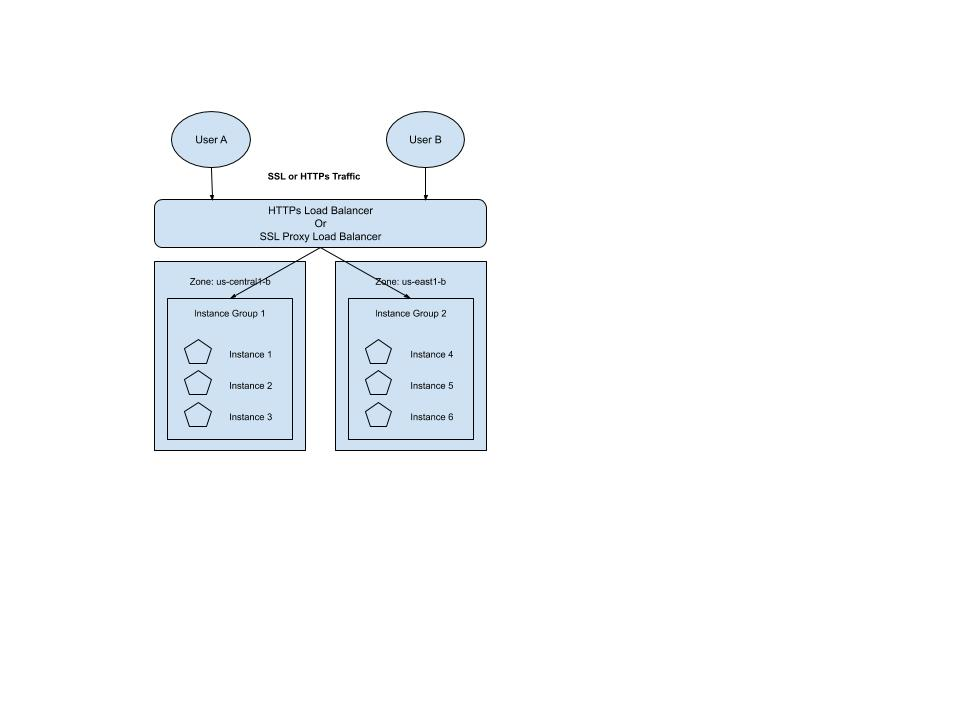
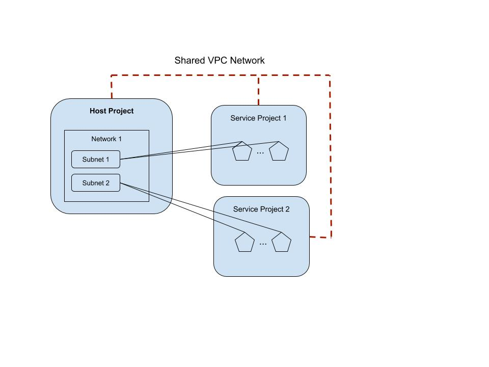

_______________________________________________________________________________
## VPC Overview
Managing networking on GCP utilizes a virtual private cloud (VPC).

### What is VPC?
VPC is a global private isolated Virtual Network. VPC network on GCP allows you to create and control your own private logically isolated network.
* On this network, you can deploy your own Google compute resources.
  * GCE instances, GKE intsances, etc.
* Each VPC network in your project provides private communication between your GCP compute resources.

## VPC Firewall
* You can control individual incoming and outgoing traffic for compute resources using *firewall rules*.
* You can connect your own premise network with your VPC network using either at IPsec VPN tunnel or a dedicated interconnect.
  * IPsec VPN tunnel: an Internet Protocol security tunnel is a set of standards and protocols to support secure communication as packets of information are transported from an IP address across network boundaries and vice versa.
    * an IPsec tunnel allows for the implementation of a VPN which an enterprise may use to securely extend its reach beyond its own network to customers, partners and suppliers.
    * IPsec tunnel vs. SSL/TSL:
      * IPsec tunnel provides the most robust cryptographic security: IPsec tunnel encrypts the entire packet of data so fully that no entity can see the source of the data, the data endpoint or the data origination point.
      * SSL/TSL does not have this type of encryption.

GCP firewall rules enable you to allow or deny traffic communication with your VM instances based on a configuration you specify.
* The rules can be applied both ingress and egress traffic.

GCP firewall rules provide enough active network protection and traffic control **regardless of the OS your instances use**.

GCP firewall rules are defined on the VPC as a whole. Since VPC networks can be global in GCP, the firewall rules are also **global**.
* Every VPC network functions as a distributed firewall.
* Firewall rules are defined at a network level, but connections are allowed or denied *on a per instance basis*. In other words, your firewall rules exist not only between your instances and other networks, but also between individual instances within the same network.

### Ways to apply firewall rules
You can apply the firewall rules to all instances in the network meaning that the defined rules apply to every instance running in that VPC network without tags or marks to the incidence in any way.

You can apply rules to instances that are referenced with a tag/name. This requires the instance bound to the firewall rule to be labeled with the firewall rule *target tag*.

You can apply rules based on the service accounts meaning the rules are applied to both new and existing instances that are associated with a service account.
* Note: changing the service account associated with an instance requires you to *stop and reboot* the instance for that change to take effect.

GCP firewall rules are **STATEFUL**. For each initiated connection that is tracked by allow rules in one direction, the return traffic is automatically allowed regardless of any other rule in place. **Firewall rules allow bidirectional communications.**

### Firewall Rule Settings
<table>
    <th>Parameter</th>
    <th>Details</th>
    <tr>
        <td>direction</td>
        <td>ingress or egress (incoming or outgoing)</td>
    </tr>
    <tr>
        <td>source</td>
        <td>only applicable to ingress rules, can be IP address or range, a source tag or a source service account</td>
    </tr>
    <tr>
        <td>destination</td>
        <td>only applicable to egress rules</td>
    </tr>
    <tr>
        <td>protocol and port</td>
        <td>rules can be restricted to apply to specific protocols (e.g., TCP or UDP) only or combinations of protocols and ports only</td>
    </tr>
    <tr>
        <td>action</td>
        <td>allow or deny</td>
    </tr>
    <tr>
        <td>priority</td>
        <td>0-65535, the order in which rules are evaluated, the first matching rule is applied</td>
    </tr>
</table>

### VPC Firewall Defaults
All VPCs have 2 implied firewall rules:
* Allow all outgoing traffic to any IP address:
  * action is *allow*
  * destination is *0.0.0.0/0*
  * lowest priority: 65535
* Block all incoming traffic:
  * action is *deny*
  * source is *0.0.0.0/0*
  * lowest priority: 65535

In GCP, all projects get a default VPC created automatically. In additional to the implied rules above and auto-generated VPC, the network is pre-populated with follow rules that allow incoming traffic to instances:
* **`default-allow-internal`** enables incoming connections within the VPC network for all protocols and ports *between instances*. In other words, the rule permits inbound connections between VM instances in the same network.
* **`default-allow-ssh`** allows port 22, secure shell, or SSH
* **`default-allow-rdp`** allows port 3389, Remote Desktop Protocol (RDP)
* **`default-allow-icmp`** allows ICMP traffic from any source IP to any destination instance within the VPC network.

### VPC Firewall Best Practices
There is some network traffic that is always blocked on VPC networks. This traffic cannot be unblocked with firewall rules. The traffic that is always blocked is all GRE traffic, *unless explicitly allowed through protocol forwarding*.
<table>
    <th>Blocked Traffic</th>
    <th>Applies to</th>
    <tr>
        <td>GRE traffic</td>
        <td>all sources, all destinations, including among instances using internal IP addresses, unless explicitly allowed through <i>protocol forwarding</i></td>
    </tr>
    <tr>
        <td>Protocal other than TCP, UDP, ICMP and IPIP</td>
        <td>
            Traffic between:
            <ul>
                <li>instances and the internet</li>
                <li>instances if they are addressed with external IP addresses</li>
                <li>instances if a load balancer with an external IP address is involved</li>
            </ul>
        </td>
    </tr>
    <tr>
        <td>Egress traffic on TCP port 25 (SMTP)</td>
        <td>
            Traffic from:
            <ul>
                <li>instances to the internet</li>
                <li>instances to other instances addressed by external IP addresses</li>
            </ul>
        </td>
    </tr>
    <tr>
        <td>Egress traffic on TCP port 465 or 587 (SMTP over SSL/TLS)</td>
        <td>
            Traffic from:
            <ul>
                <li>instances to the internet, except for traffic destined for know Google SMTP servers</li>
                <li>instances to other instances addressed by external IP addresses</li>
            </ul>
        </td>
    </tr>
</table>

#### Best practices to secure instances running in GCE
1. Keep your firewall rule inline with the model of least privilege, create rules to explicitly allow only the traffic necessary for your applications to communicate.
2. Minimize direct exposure tot the internet. Avoid having firewall rules defined within the source or destination range set to **0.0.0.0/0**.
3. Prevent port and protocols from being exposed accidentally. Create a firewall rule with the lowest priority that blocks all outbound traffic for all protocols and ports.
  * This rule will override the implied egress rule that allows all outbound traffic, thereby will lock down your GCE instance from making connections.
  * Then you can create higher priority firewall rules to specify GCE instances to open required ports and protocols.
4. Adopt a standard naming convention for firewall rules.
For example, `{direction}-{allow/deny}-{service}-{to-from-location}`.
* `ingress-allow-ssh-from-onprem`
* `egress-allow-all-to-gcevms`
5. Consider service account firewall rules instead of tag-based rules. The reason for this is that tag-based firewall rules can be applied by any user who has GCE instance admin role, but a service account requires a user to have explicit Cloud IM rights to be used.

To create a network with auto subnets in GCP:

<pre>
gcloud compute networks create my_network --subnet-mode=auto
</pre>

Note: when an auto mode VPC network is created, one subnet from each region is automatically created within it. The automatically created subnets use a set of predefined IP ranges that fit within the 10.128.0.0/9 CIDR block.

To create the network with custom subnets, you can choose any private RFC 1918 CIDR block for the primary IP address range of the subnets.

<pre>
gcloud compute networks create private_net --subnet-mode=custom
</pre>

To create a custom subnet in the private_net network:

<pre>
gcloud compute networks subnets create private_subnet \
    --network=private_net --region=us-central1 \
    --range=10.0.0.0/24 --enable-private-ip-google-access
</pre>

To add a firewall rule that allows port 22 (SSH) traffic from the Cloud Shell IP address, run the following command:

<pre>
ip=$(curl -s https://api.ipify.org)
gcloud compute firewall-rules create \
    mynetwork-ingress-allow-ssh-from-cs \
    --network mynetwork --action ALLOW --direction INGRESS \
    --rules tcp:22 --source-ranges $ip --target-tags=lab-ssh
</pre>

To apply this firewall rule to certain instances in the network, add `lab-ssh` tag to the instances:

<pre>
gcloud compute instances add-tags mynet-eu-vm \
    --zone europe-west1-b \
    --tags lab-ssh
gcloud compute instances add-tags mynet-us-vm \
    --zone us-central1-a \
    --tags lab-ssh
</pre>

To add a firewall rule that allows ALL instances in the mynetwork VPC to ping each other, run the following command:

<pre>
gcloud compute firewall-rules create \
    mynetwork-ingress-allow-icmp-internal --network \
    mynetwork --action ALLOW --direction INGRESS --rules icmp \
    --source-ranges 10.128.0.0/9
</pre>

### Load Balancing and SSL Policies
GCP load balancer supports HTTPs and SSL/TSL proxies for encryption in transit.

* These load balancers require at least one signed SSL certificate installed on the target HTTPs proxy for the load balancer.
  * You can use Google-managed or self-managed SSL certificates.
  * Client SSL session will terminate at the load balancer.
  * Google Cloud load balancer terminates user SSL connections at the load balancing layer, then balances the connections across instance using the SSL or TCP protocols.

Cloud SSL proxy is intended for *non HTTPs traffic*. For HTTPs traffic, HTTPs load balancing is recommended.

#### SSL policies
SSL policy gives you the ability to control the features of SSL that your SSL proxy or HTTPs load balacner negotiates with the clients.
* a SSL policy specifies a minimum TLS version and a profile.
  * a profile selects a set of SSL features to be enabled in the load balancer.
  * there are 3 preconfigured Google managed profiles that allow you to specify the level of compatability appropriate for your application.

Preconfigured SSL policy profiles:
* Compatible: allows the broadest set of clients including the ones that support out-to-date SSL features.
* Modern: supports a wide set of SSL features allowing modern clients to negotiate SSL.
* Restricted: supports a reduced set of SSL features, intended to meet stricter compliance requirements.

You can also create custom SSL policy profiles. These profiles allow SSL features to be individually specified.

### Interconnect and VPC peering options
VPC peering allows you to create connectivity across two non-overlapping VPC networks.
* VPC peering enables the resources in these networks to communicate across private RFC 1918 space, reducing exposure to attacks.
* Peer networks do *NOT* need to be in the same project or even the same organization.
* The network firewall rules and routes are independently managed by the project in which each VPC belongs to.
  * These network firewall rules are not imported across the peered networks.
  * To control traffic, you need to configure rules in each of the peered VPCs to marshal communication between them.
* Currently a network can have up to 25 directly peered VPC networks. These networks can be connected in a series or hub-spoke style topology, as long as subnets do *NOT* overlap.

VPC network peering does not provide granular root controls to filter out which subnet sliders are reachable across paired networks. In order to achieve this, you must use firewall rules to filter traffic.

Once networks have peered, every internal private IP is accessible across the peered networks.

VPC network peering gives you several advantages over using external IP addressed or VPNs to connect to the networks:
* decrease network latency: networking public IPs suffers from higher latency than private networking.
* increase network security: service owners do not need to have their services exposed to the public internet and deal with its associated risks.
* lower network costs: GCP charges egress bandwidth pricing for networks using external IPs to communicate even if the traffic is within the same zone. However if the networks appears that they can use the internal IPs to communicate and save on those egress costs.

#### Shared VPCs
* Allows an organization to connect resources for multiple projects to a common VPC network so that they can communicate with each other securely and effectively using **internal IPs**.
* When you use a shared VPC, you designate a project as **a host project**, and attach one or more service projects to it. The VPC networks in the host project are called shared VPC networks.

Shared VPCs are used to connect projects within the SAME organization. Participating host projects and service projects cannot belong to different organizations.

#### How to connect to cloud VPC network from your on-prem network
Some organizations may want to securely extend their data center network (on-prem network) into GCP projects. You can accomplish this through either a Google Cloud VPN or Google Cloud Interconnect.

##### Cloud Interconnect
Two options for connecting on-premise networks to GCP:
* Dedicated interconnect
  * A dedicated intterconnect provides a direct physical connection between your on-premise network and your GCP VPC networks.
  * Dedicated interconnect has a min. badwidth of 10GB per second. (FAST)
  * Dedicated interconnect requires routing equipment in a colocation facility that supports the GCP regions that you will want to connect to. All traffic flows directly between your on-premise network and GCP VPC network. Nothing is traveling on the public internet.
* Partner interconnect
  * Partner interconnect provides connectivity between your on-premise network and GCP VPC networks through a supported service provider.
  * Partner interconnect has bandwidth with 50MB per second. (SLOW)
  * Partner interconnect connects to a variety of service providers to reach your VPC network. All traffic flows through a service provider's network and nothing is traveling on the public internet.

Both of the above have low latency, highly available and dedicated connections to enable you to reliably transfer data between your on-premise and VPC networks.

### VPC Network Best Practices
1. Always create a new network with the regions, IP address ranges and follow rules that your orgnization needs. *Delete the default network so it is not accidentally used.*
2. Place GCE resources that require network communication on the same VPC network.
3. Think about creating separate subnets within a network for each tier of an application.
   * For example, the web frontend, service layer, or database backend.
4. Use a Cloud load balancer with SSL policies in front of web servers. Place a load balancer in front of an old web service provides many benefits including:
   * providing Global Anycast IP address and built-in DDoS protection and mitigation.
   * using SSL policies allows you to control the SSL encryption used for the encryption in transit.
5. Private Google API access enables GCE instances on a VPC subnet to reach Google APIs and services using an internal IP address rather than an external IP address.

### VPC Service Controls
VPC Service Controls improve your ability to reduce the risk of data exfiltration from your Google-managed services like Cloud Storage and BigQuery.
* Data exfiltration: a form of security breach that occurs when data is copied, transferred or retrieved from a computer or server without authorization.
* VPC Service Controls create security perimeters around your Google-managed resources and allow you to control the movement of data across that perimeter.
  * VPC Service Controls protect resources within a perimeter so that they can only be privately accessed from clients within authorized VPC networks using private Google access with either Google Cloud or on-premises.
