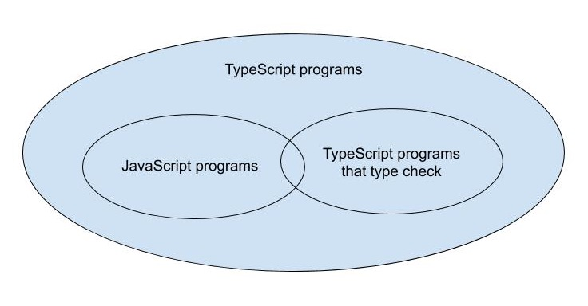

## TypeScript is a superset of JavaScript

What does "TypeScript is a superset of JavaScript" mean?

Syntactically, if your JavaScript program does not have any syntax errors, then it is also a TypeScript program. :)
* TypeScript type checker might flag some issues of your JavaScript code during compilation, but it is a separate topic of problems.
* TypeScript compiler will parse your code successfully and **emit** JavaScript.
* All JavaScript programs are TypeScript programs.

TypeScript is NOT a completely different language from JavaScript, since the code in your .js files is already TypeScript.
* You do not need to rewrite any of your code while migrating to TypeScript.

There are TypeScript programs that are not JavaScript programs, because TypeScript might add additional syntax for specifying types.
<pre>
// This is a TypeScript program, but not JavaScript
function greet(who: string) {
    console.log('Hello ', who);
}
</pre>

### Catch exceptions at compilation time
<pre>
let city = 'new york city';
console.log(city.toUppercase());
// TypeError: city.toUppercase is not a function
</pre>

There is no type annotation in the above example code, but TypeScript type checker will spot the problem: Property `toUppercase` does not exist on type `string`. Did you mean `toUpperCase`?

The code did not explicitly tell TypeScript that the type of `city` is a string, it inferred it from the initial value.

**One of the goals of TypeScript type system is to detect code taht will throw an exception at runtime, without having to run your code.**
* TypeScript cannot *always* spot code that will throw exceptions, but it will try.

### Prevent runtime unexpected behavior
<pre>
const states = [
    {name: 'California', capital: 'Sacramento'},
    {name: 'Washington', capital: 'Olympia'},
    // ...
];
for (const state of states) {
    console.log(state.capitol); // typo
}
// Output:
// undefined
// undefined
</pre>

This program is a valid JavaScript program (and thus a valid TypeScript). But it clear did not do what you intended.

TypeScript type checker will spot this error: Property `capitol` does not exist on type `{name: string, capital: string}`. Did you mean `capital`?

Type annotations tell TypeScript what your **intent** is.

TypeScript type system tries to model the **runtime behavior of JavaScript**. You might be suprised by some cases if you are coming from a language with stricter runtime checks:
<pre>
const x = 2 + '3'; // OK, type is string: x = '23'
const y = '2' + 3; // OK, type is string: y = '23'
</pre>
However it does go beyond JavaScript runtime behavior:
<pre>
// Evaluates to 2 in JS, "Operator '+' cannot be applied to types..."
const a = null + 2;
// Evaluates to '12' in JS, "Operator '+' cannot be applied to types..."
const a = [] + 12;
// Alert with 'Hello' in JS, "Expected 0-1 arguments, but got 2"
alert('Hello', 'TypeScript');
</pre>
